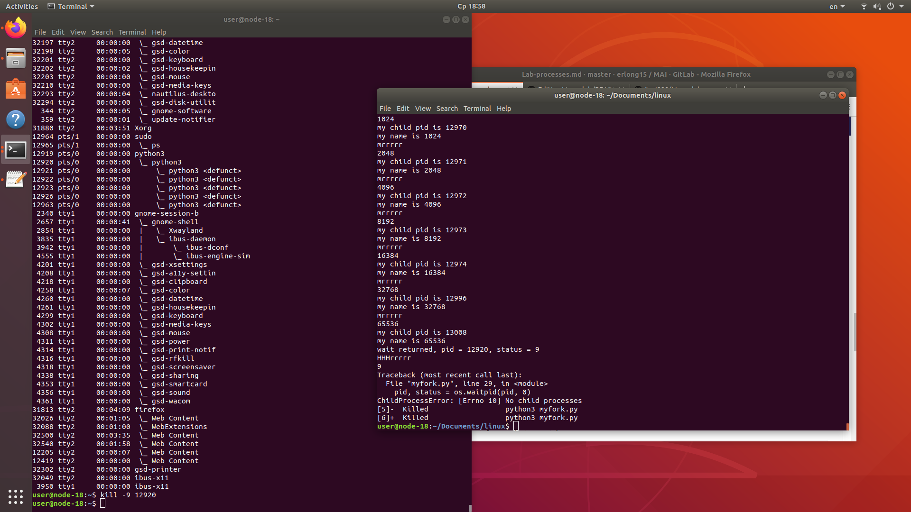
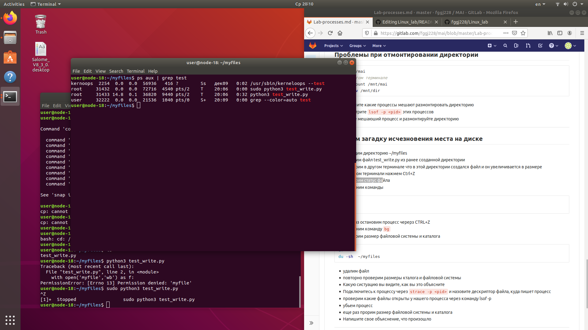

# Linux lern
---------------------------------------------------------------------------
___________________________________________________________________________
# lab_AAA

* попробуйте из под user3 выполнить sudo ls -l /root

* почему у вас не получилось?

user3 отсутствует в файле sudoers. Данное действие будет занесено в журнал

* добавьте запись о user3 и admins в /etc/sudoers 


__________________________________________________________________________
--------------------------------------------------------------------------
__________________________________________________________________________
# lab_procces

* Какой размер дисков?

один диск на 931.5 гб

* Есть ли неразмеченное место на дисках?
Нет
    
* Какой размер партиций?


* Какая таблица партционирования используется?
GPT

* Какой диск, партция или лвм том смонтированы в /


-----------------------------------------------------

* Создадим сжатую файловую систему для чтения squashfs


* Какая файловая система примонтирована в /


* С какими опциями примонтирована файловая система в /

/dev/sda4 on / type ext4 (rw,relatime,errors=remount-ro)

* Какой размер файловой системы приментированной в /mnt/mai

/dev/loop20      128K         128K     0          100% /mnt/mai

--------------------------------------------------------------
* Что такое tmpfs
tmpfs - временное файловое хранилище

* какая часть памяти изменялась?


---------------------------------------------------------------

* Какие процессы в системе порождают дочерние процессы через fork
gdm3
systemd
firefox

* Какие процессы в системе являются мультитредовыми
nfsd
firefox
jfsCommit

------------------------------------------------------------------
ps axo rss | tail -n +2|paste -sd+ | bc
* Что подсчитывается этой командой
Количество занятой оперативной памяти не в swap использованное в процессах вссех пользоателей

* Почему цифра такая странная
потому что она в килобайтах

------------------------------------------------------------------

* Уставновим утилиту smem и проанализируем параметр PSS в ней


-------------------------------------------------------------------
* Запустим приложеннный скрипт и понаблюдаем за процессами
python myfork.py

* в другом терминале  отследите порождение процессов


* отследите какие состояния вы видите у процессов
T and Z

* почему появляются процессы со статусам Z
это зомби процесс

* какой PID у основного процесса
26151 pts/2    00:00:00 python

* убейте основной процесс kill -9 <pid>
    
* какой PPID стал у первого чайлда

26153

* насколько вы разобрались в скрипте и втом что он делает?
в цикле делает fork()
    
------------------------------------------------------------------
* Научимся корректно завершать зомби процессы

* запустим еще раз наш процесc, убьем процесс первого чайлда u
* проверим его состояние  и убедимся что он зомби


* расскоментируем строки в скрипте
* поторим все еще раз
* отследим корректное завершение чайлда


------------------------------------------------------------------
## Научимся убивать зомби процессы

* запускаем процессс еще раз


------------------------------------------------------------------
## Проблемы при отмонтировании директории
* Напишите какие процессы мешают размонтировать директорию
target is busy
user 18558 ..c.. bush
мешает bush, когда убиваем его процесс все работает

------------------------------------------------------------------
## Решаем загадку исчезновения места на диске

* проверим статус файла


* проверим размер файловой системы и каталога
user@node-18:~/myfiles$ df 
/dev/sda4      637843200 32783344 572589432   6% /

user@node-18:~/myfiles$ du -sh  ~/myfiles
7,4G	/home/user/myfiles

* удалим файл
* повторно проверим размеры кталога и файловой системы

user@node-18:~/myfiles$ df 
/dev/sda4      637843200 58350616 547022160  10% /


user@node-18:~/myfiles$ du -sh  ~/myfiles
8,0K	/home/user/myfiles

После удаление файла процесс записи продолжается, файла в котологе больше нет, но место файловой системе уменьшается из-за не остановленного процесса

## Утилиты наблюдения
* проверьте текущий LA 
load average: 3,37, 2,80, 2,2 cat /proc/loadavg

* запишите top 3 процессов загружающих CPU 
top -b -o +%CPU | head -n 10

* запишите top 3 процессов загружающих память 
top -b -o +%MEM | head -n 10

* запустите утилиту atop как сервис через systemd

```
vagrant@ubuntu-xenial:/usr/bin$ sudo nano /etc/systemd/system/atop1.service
vagrant@ubuntu-xenial:/usr/bin$ sudo systemctl enable atop1.service
vagrant@ubuntu-xenial:/usr/bin$ sudo systemctl start atop1.service
vagrant@ubuntu-xenial:/usr/bin$ sudo systemctl status atop1.service
● atop1.service - AtopService
   Loaded: loaded (/etc/systemd/system/atop1.service; static; vendor preset: enabled)
   Active: active (running) since Sat 2019-12-21 22:24:34 UTC; 7s ago
   Main PID: 3254 (atop)
   Tasks: 1
      Memory: 1.3M
      CPU: 6ms
      CGroup: /system.slice/atop1.service
              └─3254 /usr/bin/atop

Dec 21 22:24:34 ubuntu-xenial atop[3254]:   417   0.00s   0.00s     0K     0K     0K     0K N-   - S   0% kauditd
Dec 21 22:24:34 ubuntu-xenial atop[3254]:   487   0.00s   0.00s     0K     0K     0K     0K N-   - S   0% iprt-VBoxWQueu
Dec 21 22:24:34 ubuntu-xenial atop[3254]:  2113   0.00s   0.00s     0K     0K     0K     0K N-   - S   0% kworker/0:2
Dec 21 22:24:34 ubuntu-xenial atop[3254]:  3073   0.00s   0.00s     0K     0K     0K     0K N-   - S   0% kworker/1:0
Dec 21 22:24:34 ubuntu-xenial atop[3254]:  3133   0.00s   0.00s     0K     0K     0K     0K N-   - S   0% kworker/1:2
Dec 21 22:24:34 ubuntu-xenial atop[3254]:  3251   0.00s   0.00s     0K     0K     0K     0K N-   - Z   0% sudo
Dec 21 22:24:34 ubuntu-xenial atop[3254]:  3255   0.00s   0.00s     0K     0K     0K     0K N-   - S   0% kworker/0:0
Dec 21 22:24:34 ubuntu-xenial atop[3254]:  3253   0.00s   0.00s     0K     0K      -      - NE   0 E   0% <systemd-tty->
Dec 21 22:24:34 ubuntu-xenial atop[3254]:  3252   0.00s   0.00s     0K     0K      -      - NE   0 E   0% <systemctl>
Dec 21 22:24:34 ubuntu-xenial atop[3254]:  3251   0.00s   0.00s     0K     0K      -      - -E   0 E   0% <sudo>
```
    
* запустите dd на генерацию файла размер в 3 гигабайта

```
vagrant@ubuntu-xenial:/usr/bin$ sudo dd of=file bs=1 count=0 seek=3G
0+0 records in
0+0 records out
0 bytes copied, 0.00047458 s, 0.0 kB/s
```

* удалите сгенеренный файл

```
vagrant@ubuntu-xenial:~$ rm file
rm: remove write-protected regular file 'file'? y
```
